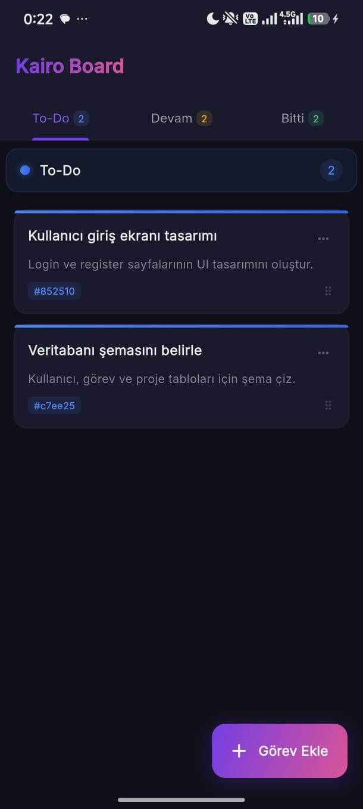
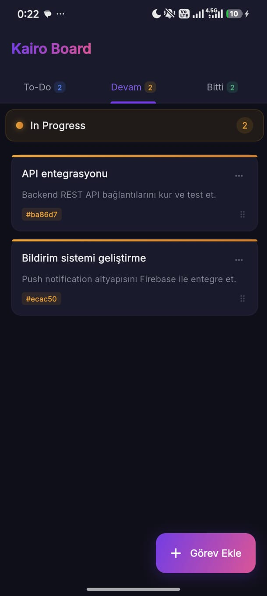
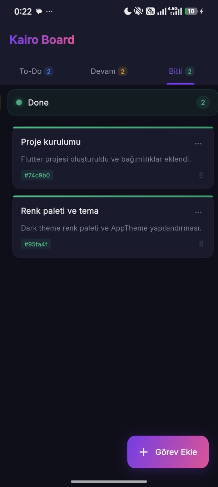
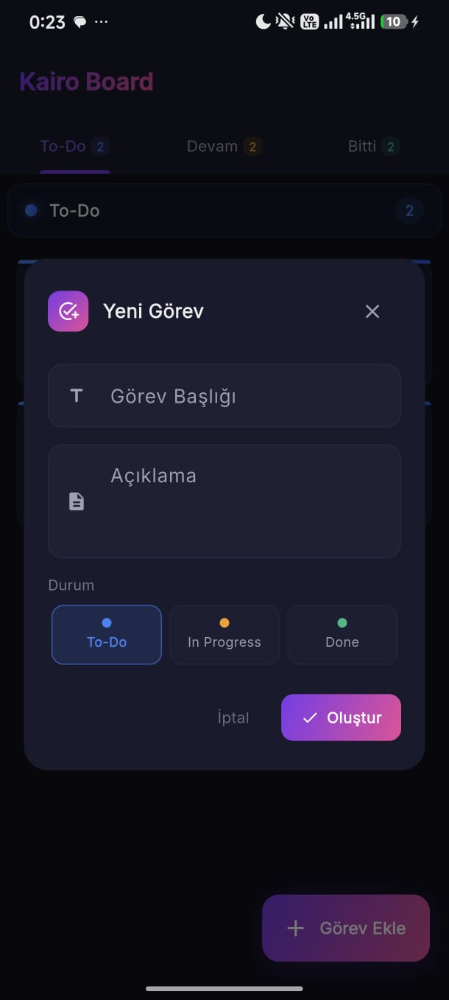

# 🚀 Kairo - Kanban To-Do List


<p align="center">
  <strong>Modern, şık ve performanslı bir Kanban board görev takip uygulaması.</strong>
</p>

<p align="center">
  
  
  
  
</p>

---

## 📸 Ekran Görüntüleri

<p align="center">
  
     
  
     
  
</p>

<p align="center">
  
     
</p>

---

## ✨ Özellikler

| Özellik                          | Açıklama                                                                         |
| -------------------------------- | -------------------------------------------------------------------------------- |
| 🌙 **Dark Theme**                | Göz yormayan modern karanlık tema, gradient vurgularla premium hissiyat          |
| 🎨 **Gradient & Glow Efektleri** | Butonlarda, kartlarda ve durum göstergelerinde canlı gradient geçişleri          |
| 📋 **Kanban Board**              | Üç kolonlu yapı: **To-Do**, **Devam Eden**, **Tamamlanan**                       |
| ✏️ **CRUD İşlemleri**            | Görev oluşturma, düzenleme, silme ve durum değiştirme                            |
| 🔀 **Sürükle & Bırak**           | `LongPressDraggable` ile görevleri kolonlar arasında sürükleyerek taşıma         |
| 📱 **Responsive Tasarım**        | Mobilde tab görünümü, tablette ve masaüstünde yan yana kolonlar                  |
| ⚡ **Performans Odaklı**          | `RepaintBoundary`, pre-computed renkler, `const` widget'lar ile optimize edilmiş |
| 🏗️ **Temiz Mimari**             | Feature-first klasör yapısı ile sürdürülebilir ve ölçeklenebilir kod             |

---

## 🏗️ Proje Mimarisi

```
lib/
├── main.dart
├── core/
│   ├── theme/
│   │   └── app_theme.dart          # Dark tema, renkler, gradientler
│   ├── utils/
│   │   └── enums.dart              # TaskStatus enum
│   └── widgets/
│       └── animated_card.dart      # Yeniden kullanılabilir animasyonlu kart
│
└── features/
    └── kanban_board/
        ├── domain/
        │   └── models/
        │       └── task_model.dart  # Görev veri modeli
        └── presentation/
            ├── providers/
            │   └── kanban_provider.dart  # Riverpod state yönetimi
            ├── screens/
            │   └── kanban_board_screen.dart  # Ana ekran
            └── widgets/
                ├── kanban_column.dart   # DragTarget kolon widget'ı
                ├── task_card.dart       # LongPressDraggable görev kartı
                └── task_dialog.dart     # Görev ekleme/düzenleme dialogu
```

---

## 🛠️ Kullanılan Teknolojiler

- **Flutter 3.x** — Cross-platform UI framework
- **Dart 3.x** — Programlama dili
- **flutter_riverpod** — Reaktif state management
- **uuid** — Benzersiz görev ID üretimi
- **google_fonts** — Inter font ailesi ile modern tipografi

---

## 🚀 Kurulum

### Gereksinimler

- Flutter SDK `>=3.0.0`
- Dart SDK `>=3.0.0`

### Adımlar

```bash
# 1. Projeyi klonlayın
git clone https://github.com/KULLANICI_ADINIZ/kairo-todo.git

# 2. Proje dizinine gidin
cd kairo-todo

# 3. Bağımlılıkları yükleyin
flutter pub get

# 4. Uygulamayı çalıştırın
flutter run
```

---

## 📱 Kullanım

### Görev Ekleme

1. Sağ alttaki **"Görev Ekle"** FAB butonuna tıklayın
2. Görev başlığı ve açıklamasını girin
3. **Durum seçiciden** hangi kolona ekleneceğini seçin (To-Do / Devam Eden / Tamamlanan)
4. **"Oluştur"** butonuna tıklayın

### Görev Taşıma (Drag & Drop)

1. Bir görev kartına **uzun basın** (long press)
2. Kartı istediğiniz kolona **sürükleyin**
3. Bırakıldığında görevin durumu otomatik güncellenir

### Görev Düzenleme / Silme

- Kart üzerindeki **⋯** menüsünden veya karta dokunarak düzenleyebilir/silebilirsiniz

---

## 🎨 Tasarım Detayları

### Renk Paleti

| Renk           | Hex       | Kullanım                     |
| -------------- | --------- | ---------------------------- |
| 🟣 Primary     | `#7C3AED` | Ana vurgu rengi, butonlar    |
| 🩷 Secondary   | `#EC4899` | Gradient geçişleri           |
| 🔵 To-Do       | `#3B82F6` | Yapılacak görevler           |
| 🟡 In Progress | `#F59E0B` | Devam eden görevler          |
| 🟢 Done        | `#10B981` | Tamamlanan görevler          |
| ⬛ Background   | `#0F0F1A` | Ana arka plan                |
| 🌑 Surface     | `#1A1A2E` | Kart ve dialog arka planları |

### Performans Optimizasyonları

- `BackdropFilter` kullanılmadan glassmorphism efekti (opacity + border ile)
- `RepaintBoundary` ile TextFormField izolasyonu
- `MediaQuery.removeViewInsets` ile çift rebuild engelleme
- `const` constructor'lar ve pre-computed renkler
- `LongPressDraggable` ile scroll-drag çakışması engelleme

---

## 🤝 Katkıda Bulunma

1. Bu projeyi **fork** edin
2. Yeni bir branch oluşturun (`git checkout -b feature/yeni-ozellik`)
3. Değişikliklerinizi commit edin (`git commit -m 'Yeni özellik eklendi'`)
4. Branch'inize push edin (`git push origin feature/yeni-ozellik`)
5. Bir **Pull Request** açın

---

## 📄 Lisans

Bu proje [MIT Lisansı](LICENSE) altında lisanslanmıştır.

---

<p align="center">
  ⭐ Bu projeyi beğendiyseniz yıldız vermeyi unutmayın!
</p>
